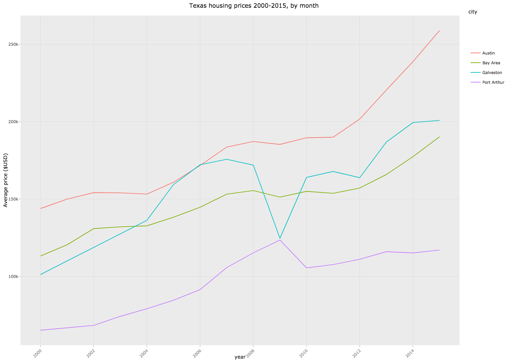

This RMarkdown file contains an examples of interactive plots in R. 

#### Let's start by loading the requires packages
<div style="margin-bottom:20px;">
</div>


```r
devtools::install_github('hadley/ggplot2')
pacman::p_load(plotly, dplyr)
```


#### Now, let's use some pre-loaded data
<div style="margin-bottom:20px;">
</div>


```r
data(txhousing)
```


##### Select variables, subset by city, omit missing variables, convert to data frame
<div style="margin-bottom:20px;">
</div>


```r
tx = txhousing %>%
        select(city, month, median, year) %>%
        filter(city %in% c('Galveston', 'Bay Area', 'Port Arthur', 'Austin')) %>% 
        group_by(city, year) %>% 
        summarise(avg = mean(median)) %>% 
        na.omit() %>% 
        data.frame() 
```


##### Explore data
<div style="margin-bottom:20px;">
</div>


```r
nrow(tx)
```

```
## [1] 60
```

```r
head(tx)
```

```
##     city year      avg
## 1 Austin 2000 143925.0
## 2 Austin 2001 149991.7
## 3 Austin 2002 154191.7
## 4 Austin 2003 154058.3
## 5 Austin 2004 153250.0
## 6 Austin 2005 160891.7
```

#### Static ggplot of housing prices by month, stratified by city 
<div style="margin-bottom:20px;">
</div>


```r
texas_plot = ggplot(tx, aes(x = year, y = avg, color = city), factor = city) + 
        geom_path() +
        labs(y = 'Average price ($USD)', 
             title = 'Texas housing prices 2000-2015, by month') + 
        theme(axis.text.x = element_text(angle = 45, hjust = 1)) + 
        scale_x_continuous(breaks = pretty(tx$year, n = 15))
```


```r
print(texas_plot)
```

<!-- -->


#### Making it interactive with plot_ly
<div style="margin-bottom:20px;">
</div>


```r
texas_plotly = plot_ly(data = tx, x = ~year, y = ~avg) %>% 
        add_lines(color = ~city) %>% 
        rangeslider() %>% 
        layout(xaxis = list(title = ""))
#(texas_plotly, "texas_plotly.png")
```

Here is a static image of the plot, or [click here](https://plot.ly/~erikabraithwaite/32) to access my plotly account for the interactive version.


