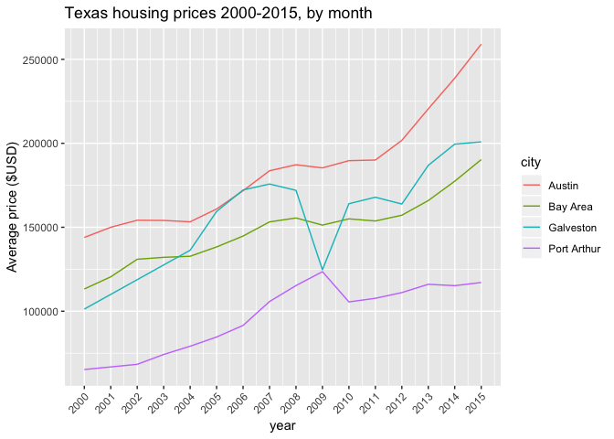

This RMarkdown file contains an examples of interactive plots in R. 

#### Let's start by loading the requires packages
<div style="margin-bottom:20px;">
</div>


```r
devtools::install_github('hadley/ggplot2')
pacman::p_load(plotly, processx, dplyr)
```


#### Now, let's use some pre-loaded data
<div style="margin-bottom:20px;">
</div>


```r
data(txhousing)
```


##### Select variables, subset by city, omit missing variables, convert to data frame
<div style="margin-bottom:20px;">
</div>


```r
tx = txhousing %>%
        select(city, month, median, year) %>%
        filter(city %in% c('Galveston', 'Bay Area', 'Port Arthur', 'Austin')) %>% 
        group_by(city, year) %>% 
        summarise(avg = mean(median)) %>% 
        na.omit() %>% 
        data.frame() 
```


##### Explore data
<div style="margin-bottom:20px;">
</div>


```r
nrow(tx)
```

```
## [1] 60
```

```r
head(tx)
```

```
##     city year      avg
## 1 Austin 2000 143925.0
## 2 Austin 2001 149991.7
## 3 Austin 2002 154191.7
## 4 Austin 2003 154058.3
## 5 Austin 2004 153250.0
## 6 Austin 2005 160891.7
```

#### Static ggplot of housing prices by month, stratified by city 
<div style="margin-bottom:20px;">
</div>


```r
texas_plot = ggplot(tx, aes(x = year, y = avg, color = city), factor = city) + 
        geom_path() +
        labs(y = 'Average price ($USD)', 
             title = 'Texas housing prices 2000-2015, by month') + 
        theme(axis.text.x = element_text(angle = 45, hjust = 1)) + 
        scale_x_continuous(breaks = pretty(tx$year, n = 15))
```


```r
print(texas_plot)
```

<!-- -->

#### Let's make it interactive with ggplotly
<div style="margin-bottom:20px;">
</div>


```r
ggplotly(texas_plot, session="knitr")
```

<!--html_preserve--><div id="cdcc1fc09e09" style="width:672px;height:480px;" class="plotly html-widget"></div>
<script type="application/json" data-for="cdcc1fc09e09">{"x":{"data":[{"x":[2000,2001,2002,2003,2004,2005,2006,2007,2008,2009,2010,2011,2012,2013,2014,2015],"y":[143925,149991.666666667,154191.666666667,154058.333333333,153250,160891.666666667,171766.666666667,183650,187233.333333333,185358.333333333,189658.333333333,190033.333333333,201741.666666667,220508.333333333,238791.666666667,259000],"text":["~year: 2000<br />~avg: 143925.00<br />~city: Austin","~year: 2001<br />~avg: 149991.67<br />~city: Austin","~year: 2002<br />~avg: 154191.67<br />~city: Austin","~year: 2003<br />~avg: 154058.33<br />~city: Austin","~year: 2004<br />~avg: 153250.00<br />~city: Austin","~year: 2005<br />~avg: 160891.67<br />~city: Austin","~year: 2006<br />~avg: 171766.67<br />~city: Austin","~year: 2007<br />~avg: 183650.00<br />~city: Austin","~year: 2008<br />~avg: 187233.33<br />~city: Austin","~year: 2009<br />~avg: 185358.33<br />~city: Austin","~year: 2010<br />~avg: 189658.33<br />~city: Austin","~year: 2011<br />~avg: 190033.33<br />~city: Austin","~year: 2012<br />~avg: 201741.67<br />~city: Austin","~year: 2013<br />~avg: 220508.33<br />~city: Austin","~year: 2014<br />~avg: 238791.67<br />~city: Austin","~year: 2015<br />~avg: 259000.00<br />~city: Austin"],"type":"scatter","mode":"lines","line":{"width":1.88976377952756,"color":"rgba(248,118,109,1)","dash":"solid"},"hoveron":"points","name":"Austin","legendgroup":"Austin","showlegend":true,"xaxis":"x","yaxis":"y","hoverinfo":"text","frame":null},{"x":[2000,2001,2002,2003,2004,2005,2006,2007,2008,2009,2010,2011,2012,2013,2014,2015],"y":[113233.333333333,120483.333333333,130941.666666667,132091.666666667,132733.333333333,138283.333333333,144766.666666667,153200,155525,151291.666666667,155000,153741.666666667,157166.666666667,165908.333333333,177433.333333333,190300],"text":["~year: 2000<br />~avg: 113233.33<br />~city: Bay Area","~year: 2001<br />~avg: 120483.33<br />~city: Bay Area","~year: 2002<br />~avg: 130941.67<br />~city: Bay Area","~year: 2003<br />~avg: 132091.67<br />~city: Bay Area","~year: 2004<br />~avg: 132733.33<br />~city: Bay Area","~year: 2005<br />~avg: 138283.33<br />~city: Bay Area","~year: 2006<br />~avg: 144766.67<br />~city: Bay Area","~year: 2007<br />~avg: 153200.00<br />~city: Bay Area","~year: 2008<br />~avg: 155525.00<br />~city: Bay Area","~year: 2009<br />~avg: 151291.67<br />~city: Bay Area","~year: 2010<br />~avg: 155000.00<br />~city: Bay Area","~year: 2011<br />~avg: 153741.67<br />~city: Bay Area","~year: 2012<br />~avg: 157166.67<br />~city: Bay Area","~year: 2013<br />~avg: 165908.33<br />~city: Bay Area","~year: 2014<br />~avg: 177433.33<br />~city: Bay Area","~year: 2015<br />~avg: 190300.00<br />~city: Bay Area"],"type":"scatter","mode":"lines","line":{"width":1.88976377952756,"color":"rgba(124,174,0,1)","dash":"solid"},"hoveron":"points","name":"Bay Area","legendgroup":"Bay Area","showlegend":true,"xaxis":"x","yaxis":"y","hoverinfo":"text","frame":null},{"x":[2000,2004,2005,2006,2007,2008,2009,2010,2011,2012,2013,2014,2015],"y":[101266.666666667,136316.666666667,159408.333333333,172208.333333333,175758.333333333,171983.333333333,124683.333333333,164025,167891.666666667,163833.333333333,186866.666666667,199500,200857.142857143],"text":["~year: 2000<br />~avg: 101266.67<br />~city: Galveston","~year: 2004<br />~avg: 136316.67<br />~city: Galveston","~year: 2005<br />~avg: 159408.33<br />~city: Galveston","~year: 2006<br />~avg: 172208.33<br />~city: Galveston","~year: 2007<br />~avg: 175758.33<br />~city: Galveston","~year: 2008<br />~avg: 171983.33<br />~city: Galveston","~year: 2009<br />~avg: 124683.33<br />~city: Galveston","~year: 2010<br />~avg: 164025.00<br />~city: Galveston","~year: 2011<br />~avg: 167891.67<br />~city: Galveston","~year: 2012<br />~avg: 163833.33<br />~city: Galveston","~year: 2013<br />~avg: 186866.67<br />~city: Galveston","~year: 2014<br />~avg: 199500.00<br />~city: Galveston","~year: 2015<br />~avg: 200857.14<br />~city: Galveston"],"type":"scatter","mode":"lines","line":{"width":1.88976377952756,"color":"rgba(0,191,196,1)","dash":"solid"},"hoveron":"points","name":"Galveston","legendgroup":"Galveston","showlegend":true,"xaxis":"x","yaxis":"y","hoverinfo":"text","frame":null},{"x":[2000,2002,2003,2004,2005,2006,2007,2008,2009,2010,2011,2012,2013,2014,2015],"y":[65275,68383.3333333333,74241.6666666667,79158.3333333333,84641.6666666667,91541.6666666667,105766.666666667,115275,123550,105541.666666667,107691.666666667,111108.333333333,116033.333333333,115216.666666667,117100],"text":["~year: 2000<br />~avg:  65275.00<br />~city: Port Arthur","~year: 2002<br />~avg:  68383.33<br />~city: Port Arthur","~year: 2003<br />~avg:  74241.67<br />~city: Port Arthur","~year: 2004<br />~avg:  79158.33<br />~city: Port Arthur","~year: 2005<br />~avg:  84641.67<br />~city: Port Arthur","~year: 2006<br />~avg:  91541.67<br />~city: Port Arthur","~year: 2007<br />~avg: 105766.67<br />~city: Port Arthur","~year: 2008<br />~avg: 115275.00<br />~city: Port Arthur","~year: 2009<br />~avg: 123550.00<br />~city: Port Arthur","~year: 2010<br />~avg: 105541.67<br />~city: Port Arthur","~year: 2011<br />~avg: 107691.67<br />~city: Port Arthur","~year: 2012<br />~avg: 111108.33<br />~city: Port Arthur","~year: 2013<br />~avg: 116033.33<br />~city: Port Arthur","~year: 2014<br />~avg: 115216.67<br />~city: Port Arthur","~year: 2015<br />~avg: 117100.00<br />~city: Port Arthur"],"type":"scatter","mode":"lines","line":{"width":1.88976377952756,"color":"rgba(199,124,255,1)","dash":"solid"},"hoveron":"points","name":"Port Arthur","legendgroup":"Port Arthur","showlegend":true,"xaxis":"x","yaxis":"y","hoverinfo":"text","frame":null}],"layout":{"margin":{"t":43.7625570776256,"r":7.30593607305936,"b":42.2242855402004,"l":60.6392694063927},"plot_bgcolor":"rgba(235,235,235,1)","paper_bgcolor":"rgba(255,255,255,1)","font":{"color":"rgba(0,0,0,1)","family":"","size":14.6118721461187},"title":"Texas housing prices 2000-2015, by month","titlefont":{"color":"rgba(0,0,0,1)","family":"","size":17.5342465753425},"xaxis":{"domain":[0,1],"type":"linear","autorange":false,"range":[1999.25,2015.75],"tickmode":"array","ticktext":["2000","2001","2002","2003","2004","2005","2006","2007","2008","2009","2010","2011","2012","2013","2014","2015"],"tickvals":[2000,2001,2002,2003,2004,2005,2006,2007,2008,2009,2010,2011,2012,2013,2014,2015],"categoryorder":"array","categoryarray":["2000","2001","2002","2003","2004","2005","2006","2007","2008","2009","2010","2011","2012","2013","2014","2015"],"nticks":null,"ticks":"outside","tickcolor":"rgba(51,51,51,1)","ticklen":3.65296803652968,"tickwidth":0.66417600664176,"showticklabels":true,"tickfont":{"color":"rgba(77,77,77,1)","family":"","size":11.689497716895},"tickangle":-45,"showline":false,"linecolor":null,"linewidth":0,"showgrid":true,"gridcolor":null,"gridwidth":0,"zeroline":false,"anchor":"y","title":"year","titlefont":{"color":"rgba(0,0,0,1)","family":"","size":14.6118721461187},"hoverformat":".2f"},"yaxis":{"domain":[0,1],"type":"linear","autorange":false,"range":[55588.75,268686.25],"tickmode":"array","ticktext":["100000","150000","200000","250000"],"tickvals":[100000,150000,200000,250000],"categoryorder":"array","categoryarray":["100000","150000","200000","250000"],"nticks":null,"ticks":"outside","tickcolor":"rgba(51,51,51,1)","ticklen":3.65296803652968,"tickwidth":0.66417600664176,"showticklabels":true,"tickfont":{"color":"rgba(77,77,77,1)","family":"","size":11.689497716895},"tickangle":-0,"showline":false,"linecolor":null,"linewidth":0,"showgrid":true,"gridcolor":null,"gridwidth":0,"zeroline":false,"anchor":"x","title":"Average price ($USD)","titlefont":{"color":"rgba(0,0,0,1)","family":"","size":14.6118721461187},"hoverformat":".2f"},"shapes":[{"type":"rect","fillcolor":null,"line":{"color":null,"width":0,"linetype":[]},"yref":"paper","xref":"paper","x0":0,"x1":1,"y0":0,"y1":1}],"showlegend":true,"legend":{"bgcolor":"rgba(255,255,255,1)","bordercolor":"transparent","borderwidth":1.88976377952756,"font":{"color":"rgba(0,0,0,1)","family":"","size":11.689497716895},"y":0.913385826771654},"annotations":[{"text":"city","x":1.02,"y":1,"showarrow":false,"ax":0,"ay":0,"font":{"color":"rgba(0,0,0,1)","family":"","size":14.6118721461187},"xref":"paper","yref":"paper","textangle":-0,"xanchor":"left","yanchor":"bottom","legendTitle":true}],"hovermode":"closest","barmode":"relative"},"config":{"doubleClick":"reset","modeBarButtonsToAdd":[{"name":"Collaborate","icon":{"width":1000,"ascent":500,"descent":-50,"path":"M487 375c7-10 9-23 5-36l-79-259c-3-12-11-23-22-31-11-8-22-12-35-12l-263 0c-15 0-29 5-43 15-13 10-23 23-28 37-5 13-5 25-1 37 0 0 0 3 1 7 1 5 1 8 1 11 0 2 0 4-1 6 0 3-1 5-1 6 1 2 2 4 3 6 1 2 2 4 4 6 2 3 4 5 5 7 5 7 9 16 13 26 4 10 7 19 9 26 0 2 0 5 0 9-1 4-1 6 0 8 0 2 2 5 4 8 3 3 5 5 5 7 4 6 8 15 12 26 4 11 7 19 7 26 1 1 0 4 0 9-1 4-1 7 0 8 1 2 3 5 6 8 4 4 6 6 6 7 4 5 8 13 13 24 4 11 7 20 7 28 1 1 0 4 0 7-1 3-1 6-1 7 0 2 1 4 3 6 1 1 3 4 5 6 2 3 3 5 5 6 1 2 3 5 4 9 2 3 3 7 5 10 1 3 2 6 4 10 2 4 4 7 6 9 2 3 4 5 7 7 3 2 7 3 11 3 3 0 8 0 13-1l0-1c7 2 12 2 14 2l218 0c14 0 25-5 32-16 8-10 10-23 6-37l-79-259c-7-22-13-37-20-43-7-7-19-10-37-10l-248 0c-5 0-9-2-11-5-2-3-2-7 0-12 4-13 18-20 41-20l264 0c5 0 10 2 16 5 5 3 8 6 10 11l85 282c2 5 2 10 2 17 7-3 13-7 17-13z m-304 0c-1-3-1-5 0-7 1-1 3-2 6-2l174 0c2 0 4 1 7 2 2 2 4 4 5 7l6 18c0 3 0 5-1 7-1 1-3 2-6 2l-173 0c-3 0-5-1-8-2-2-2-4-4-4-7z m-24-73c-1-3-1-5 0-7 2-2 3-2 6-2l174 0c2 0 5 0 7 2 3 2 4 4 5 7l6 18c1 2 0 5-1 6-1 2-3 3-5 3l-174 0c-3 0-5-1-7-3-3-1-4-4-5-6z"},"click":"function(gd) { \n        // is this being viewed in RStudio?\n        if (location.search == '?viewer_pane=1') {\n          alert('To learn about plotly for collaboration, visit:\\n https://cpsievert.github.io/plotly_book/plot-ly-for-collaboration.html');\n        } else {\n          window.open('https://cpsievert.github.io/plotly_book/plot-ly-for-collaboration.html', '_blank');\n        }\n      }"}],"cloud":false},"source":"A","attrs":{"cdcc4e7bc4f8":{"x":{},"y":{},"colour":{},"type":"scatter"}},"cur_data":"cdcc4e7bc4f8","visdat":{"cdcc4e7bc4f8":["function (y) ","x"]},"highlight":{"on":"plotly_click","persistent":false,"dynamic":false,"selectize":false,"opacityDim":0.2,"selected":{"opacity":1}},"base_url":"https://plot.ly"},"evals":["config.modeBarButtonsToAdd.0.click"],"jsHooks":{"render":[{"code":"function(el, x) { var ctConfig = crosstalk.var('plotlyCrosstalkOpts').set({\"on\":\"plotly_click\",\"persistent\":false,\"dynamic\":false,\"selectize\":false,\"opacityDim\":0.2,\"selected\":{\"opacity\":1}}); }","data":null}]}}</script><!--/html_preserve-->

#### Making it interactive with plot_ly
<div style="margin-bottom:20px;">
</div>


```r
texas_plotly = plot_ly(data = tx, x = ~year, y = ~avg) %>% 
        add_lines(color = ~city) %>% 
        rangeslider() %>% 
        layout(xaxis = list(title = ""))
#(texas_plotly, "texas_plotly.png")
```

